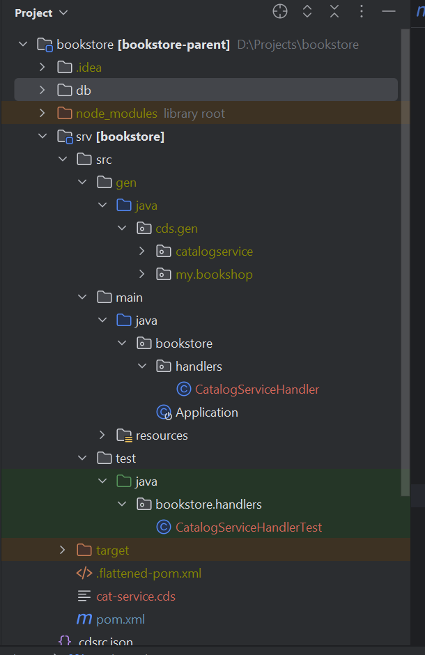
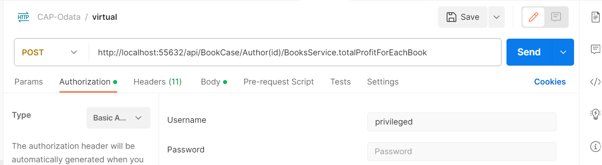

# CAP-OData-project

## Description

This is a test project about implementing Java backend microservices on SAP BTP Cloud
Foundry Platform using CAP Framework.

## [Quick start](https://cap.cloud.sap/docs/java/getting-started)

<details><summary> Description </summary> 

* Install CAP's cds-dk:

```
npm add -g @sap/cds-dk
```

* Create a project with "cds-services-archetype":

```
mvn archetype:generate -DarchetypeArtifactId="cds-services-archetype" -DarchetypeGroupId="com.sap.cds" -DarchetypeVersion="RELEASE" -DinteractiveMode=true
```

or

```
cds init <PROJECT-ROOT> --add java
```

* Use mvn-cds-plugin to add sample CDS model:

```
mvn com.sap.cds:cds-maven-plugin:addSample
```

* Use command:

```
mvn clean install -DskipTests
```

* Mark "java" folder in "get" directory as "source" to add all imports in handler:
  

* Run command to add cloudfoundry dependency in pom.xml:

```
mvn com.sap.cds:cds-maven-plugin:addTargetPlatform -DtargetPlatform=cloudfoundry
```

* To test application locally run:

```
cd <PROJECT-ROOT>
```

```
mvn spring-boot:run
```

</details>

## Before beginning

You can use Visual Studio Code to test you cds
file. [Installing VSCode](https://cap.cloud.sap/docs/get-started/jumpstart#_6-install-visual-studio-code)

## Adding entities and relations

According [Reuse a CAP Java Service](https://developers.sap.com/tutorials/cp-cap-java-service-reuse.html)
add entities (to-One and to-Many Associations) and filling they. According
the [documentation](https://cap.cloud.sap/docs/cds/cdl#managed-associations)
add Many-to-Many Association.

# FLOW

<details><summary> Description </summary> 

1. Modify scheme.cds file by adding several additional entities:

```
   entity Authors : cuid {
    firstname : String(111);
    lastname  : String(111);
    books     : Association to many Books on books.author = $self;
    }

  entity Books : cuid {
    name    : String(111) @mandatory;
    stock   : Integer;
    price   : Decimal(9,2);
    currency : Currency;
    author  : Association to Authors;
    stores  : Association to many BooksStores on stores.book = $self;
  }

  entity Stores : cuid, managed{
    name : String(111) @mandatory;
    books: Association to many BooksStores on books.store = $self;
  }
```

2. Add custom entity to managed many-to-many Association:

```
 entity BooksStores : managed{
    key book  : Association to Books @mandatory @assert.target;
    key store : Association to Stores @mandatory @assert.target;
  }
```

3. Change db to sqlLite:
    * Add [dependency](https://mvnrepository.com/artifact/org.xerial/sqlite-jdbc)
    * Change properties application.yml, url is a rout to file in you project which wil be generated
      later:
     ```
    datasource:
      url: "jdbc:sqlite:D:\\Projects\\bookstore\\db.sqlite"
       driver-class-name: org.sqlite.JDBC
       hikari:
          maximum-pool-size: 1
    sql:
      init:
        mode: always

   cds:
     odata-v4.endpoint.path: "/api"
     data-source:
     auto-config.enabled: true
      ```
    * Generate file with necessary data:
      ```
      cds add data  
      ```
    * Set uo database by running and generate db.sqlite file:
      ```
      cds deploy --to sqlite
      ```
    * Run the app:
      ```
      mvn clean spring-boot:run 
      ```
4. Send some custom request by POSTman:

```
http://localhost:8080/api/BooksService/Book(0bc4b452-ca1a-431a-b6c1-80819cf0bfa1)?$expand=author($select=ID,firstname)
```

```
http://localhost:8080/api/BooksService/Author(60edb0b6-7bc3-41e3-8321-a9fdd3f6ba63)?$expand=books($select=ID,name,stock)
```

</details>

## Adding custom events (Unbound function)

[Bound vs Unbound ](https://cap.cloud.sap/docs/guides/providing-services#bound-vs-unbound)

Difference:

* Bound

<details><summary> Description </summary> 

* Bound Actions: Bound actions are associated with a specific entity and can be invoked on that
  entity. For example, you can define a bound action "cancelOrder" for the "Order" entity, which
  will cancel an order.
* Bound Functions: Bound functions are also associated with a specific entity and can be used to
  retrieve information about that entity. For example, you can define a bound function "
  getTotalPrice" for the "Order" entity to retrieve the total price of an order.

</details>

* Unbound

<details><summary> Description </summary> 

* Unbound Actions: Unbound actions are not tied to a specific entity and can be invoked
  independently of any entity. For example, you can define an unbound action "sendNotification" that
  sends a notification.
* Unbound Functions: Unbound functions are also not tied to a specific entity and can be used
  independently. For example, you can define an unbound function "calculateTax" to calculate tax
  based on input data.

</details>

According [Extend application with Custom Code](https://developers.sap.com/tutorials/cp-cap-java-custom-logic.html)
add custom events.

### FLOW

<details><summary> Description </summary> 

1. Add custom events to "bookstore-service.cds". There
   is [function](https://cap.cloud.sap/docs/guides/providing-services#calling-actions-or-functions)
   in this case.

```
function getAllBooks (id: String) returns many BookDto;
```

2. Add services. PersistenceService from "com.sap.cds.services.persistence" package is using as
   connection between application and database. It's possible to create queries to database by CQL
   requests:

```
service.run(Select.from(cds.gen.bookstore.Books_.class)
        .where(book -> book.author_ID().eq(authorId))).listOf(Books.class);
```

3. Create BookServiceHandler.class. There are methods for handling
   events. [EventHandler phases](https://cap.cloud.sap/docs/java/provisioning-api)
   NOTE: for each event, its own context is created through the cds-plugin

```
@On(event = GetAllBooksByAuthorContext.CDS_NAME)
  public void onGetAllBooks(GetAllBooksByAuthorContext context) {
    List<Books> allBooks = bookService.getAllBooks();
    Collection<BookDto> books = bookService.getBooksForAuthor(allBooks, context.getId()).stream()
        .map(this::mapToBookDto).collect(Collectors.toList());
    context.setResult(books);
    context.setCompleted();
  }
```

4. It's possible to test application by:

```
http://localhost:port/api/BookCase/getAllBooks(id='author id value')
```

</details>

## Adding custom Event (bound action)

To understand difference between
read [Adding custom events (Unbound function)](#adding-custom-events-unbound-function):

### FLOW

<details><summary> Description </summary> 

1. Add [virtual field](https://cap.cloud.sap/docs/cds/cdl#virtual-elements) to Book entity in
   scheme.cds:

```
   virtual totalProfit  : Decimal(9,2);
```

2. Add field with [default value](https://cap.cloud.sap/docs/cds/cdl#default-values):

```
   top : Boolean default false;
```

3. Add custom events to "bookstore-service.cds". There
   is [action](https://cap.cloud.sap/docs/guides/providing-services#calling-actions-or-functions)
   which bound to entity Author. Add new methods at service layer (service package), also add update entity method.

```
 @readonly
   entity Author as projection on db.Authors
     actions{
       action totalProfitForEachBook (extra: Integer) returns array of Book;
   };
```

4. Add new methode for ServiceHandler to handle action event. This method calculates value of
   virtual field and change value of "top" field if it is necessary.

```
@On(event = TotalProfitForEachBookContext.CDS_NAME)
  public void onTotalProfitForEachBook(TotalProfitForEachBookContext context) {
    Author authorByQuery = authorService.getAuthorByQuery(context.getCqn());
    List<Book> bookForAuthor = bookService.getBookForAuthor(bookService.getAllBook(),
        authorByQuery.getId());
    bookForAuthor.forEach(books -> books.setTotalProfit(books.getPrice()
        .multiply(valueOf(books.getStock()))
        .multiply(valueOf(context.getExtra()))));
    for (Book book : bookForAuthor) {
      Boolean flag = checkTopFlag(book);
      if (flag) {
        book.setTop(flag);
        bookService.save(book);
      }
    }
    context.setResult(bookForAuthor);
    context.setCompleted();
  }
```

5. It's possible to test application by:




</details>

## Helpful links:

* [CAP tutorial in 15 part](https://bnheise.medium.com/custom-actions-in-cap-java-2-fd84b6b3720a)

